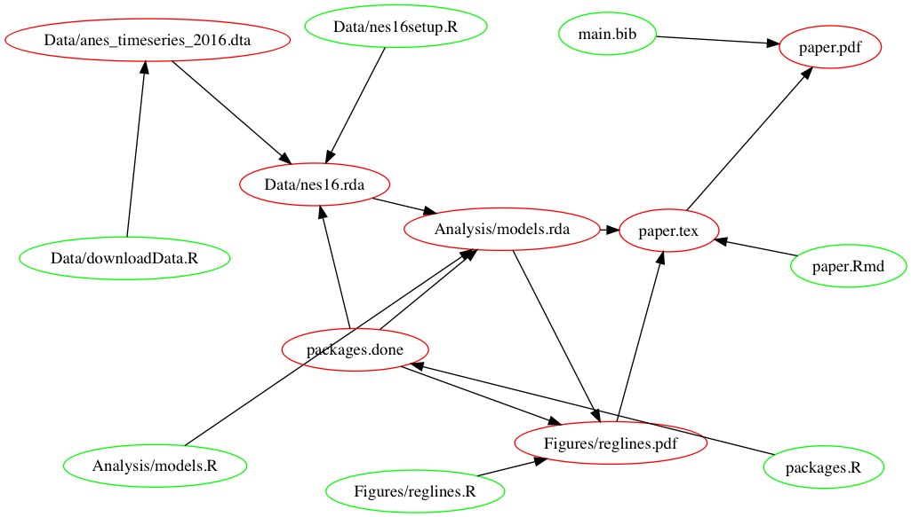

# workflow
A repository that is an example of reproducible workflow.

This version uses the GNU Makefile system. Here is a graph of the dependencies among the files in this project (created using the make2graph script installed via the homebrew system on os x):

```
make -Bnd | make2graph | dot -Tpng -o makefile.png
```

# Prerequisites

If you install the [R Package Development Prequisities](https://support.rstudio.com/hc/en-us/articles/200486498-Package-Development-Prerequisites) you should be able to reproduce this paper.


